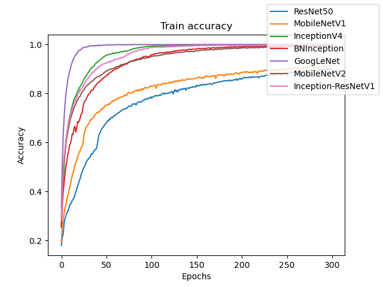

# Convolutional-Neural-Networks
This repository implements the most famous image classification CNN models from scratch in Tensorflow. The implemented models are:
* ResNet50
* MobileNetV1
* MobileNetV2
* GoogLeNet
* VGG16
* InceptionV2

In the future, this repository will be updated with other convolutional neural networks.

## Install

### Clone Repository

Clone repo and install requirements.txt in a Python==3.8.3 environment, including Tensorflow==2.7.0.

```bash
git clone git@github.com:MrRiahi/Convolutional-Neural-Networks.git
cd Convolutional-Neural-Networks
```

### Virtual Environment
Python virtual environment will keep dependant Python packages from interfering with other Python projects on your
system.

```bash
python -m venv venv
source venv/bin/activate
``` 

### Requirements

Install python requirements.

```bash
pip install --upgrade pip
pip install -r requirements.txt
```

## Train 

Set your model name, number of epochs, dataset details in `utils/config.py` and run the following command:

```bash
python train.py
```

## Evaluation
To evaluate your model, set your dataset path in `evaluate.py` and run the following command in terminal:

```bash
python evaluate.py
```

## Inference
To infer your model, set your image directory in `predict.py` and run the following command in terminal:

```bash
python predict.py
```

## Result
The result of models on test dataset are reported in the following table.

|             | loss_test | acc_test |
|-------------|:---------:|:--------:|
| MobileNetV2 |  0.5142   |  87.88   |
| ResNet50    |  0.6503   |  81.94   |

  


## Convert to TFLite
You can convert the tensorflow model to TFLite by using the following command:

```bash
python convert.py
```

Afterward, you can infer the TFLite model using the following command:

```bash
python infer_tflite.py
```

## Convert to Onnx
You can convert the tensorflow model to Onnx by using the following command in terminal:

```bash
python -m tf2onnx.convert --saved-model models/cifar-10/ResNet50 \
       --output models/cifar-10/ResNet50.onnx --opset 11 --verbos
```

Afterward, you can infer the Onnx model using the following command:

```bash
python infer_onnx.py
``` 

# TODO
- [x] Implement and train ResNet50
- [ ] Implement and train MobileNetV1
- [x] Implement and train MobileNetV2
- [x] Create a data generator for GoogLeNet
- [ ] Train GoogleNet
- [x] Add evaluation 
- [x] Add Inference
- [x] Convert models to TFLite
- [x] Convert  models to Onnx
- [x] Inference with TFLite
- [x] Inference with Onnx
- [ ] Implement and train VGG16
- [ ] Implement and train BN-Inception
- [ ] Implement and train Inception-V2
- [ ] Implement and train Inception-V3
- [ ] Implement and train Inception-ResNet-50
- [ ] Implement and train Xception
- [ ] Implement and train ResNeXt-50

# References
* ResNet50: https://arxiv.org/pdf/1512.03385v1.pdf
* MobileNetV1: https://arxiv.org/pdf/1704.04861.pdf
* MobileNetV2: https://arxiv.org/pdf/1801.04381.pdf
* GoogLeNet: https://arxiv.org/pdf/1409.4842.pdf
* VGG16: https://arxiv.org/pdf/1409.1556.pdf
* InceptionV2: https://arxiv.org/pdf/1502.03167v3.pdf


